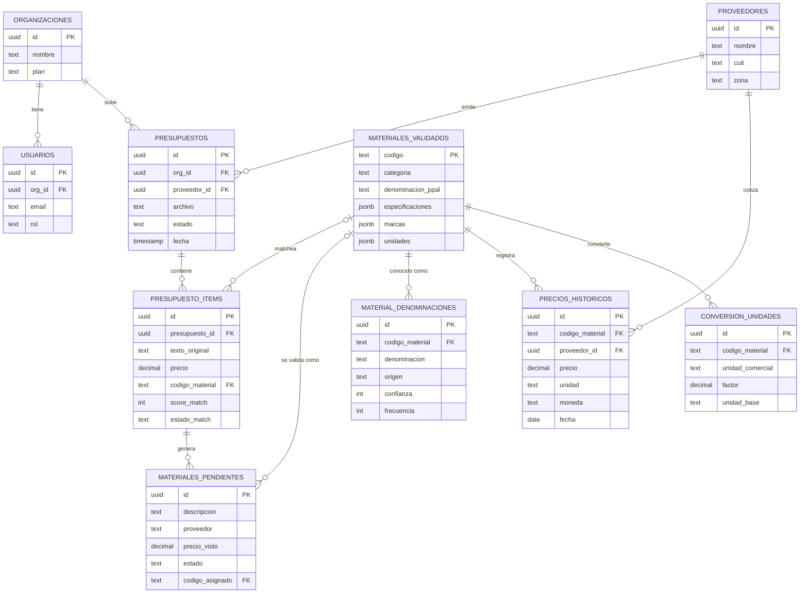

# Vectorai — Modelo de datos y flujo de lanzamiento

**Fecha:** 2026-07-02
**Relación con otros docs:** el diagrama grande "Base de Datos Maestra (modelo lógico)" con 14 tablas es el **norte conceptual** (no implementar aún). Este doc define el **corte de lanzamiento**: `SCHEMA_VECTORAI_v2.md` (4 tablas) + proveedores + conversión de unidades + tenancy.

---

## Modelo de datos de lanzamiento (10 tablas)



### Zonas del modelo

| Zona | Tablas | Notas |
|---|---|---|
| **Catálogo global compartido** (el moat) | `MATERIALES_VALIDADOS`, `MATERIAL_DENOMINACIONES`, `PRECIOS_HISTORICOS`, `CONVERSION_UNIDADES`, `PROVEEDORES` | Sin RLS por organización — cada validación beneficia a todos los clientes |
| **Cola de validación** | `MATERIALES_PENDIENTES` | Base transitoria; nada entra al catálogo sin validar |
| **Tenancy** (por cliente, RLS) | `ORGANIZACIONES`, `USUARIOS`, `PRESUPUESTOS`, `PRESUPUESTO_ITEMS` | `PRESUPUESTO_ITEMS` es la bisagra: cada línea del PDF con su `score_match` y `estado_match` |

### Qué queda para el modelo conceptual (fase 2+)

- Jerarquía `CATEGORIAS → TIPOS → SUBTIPOS` (por ahora: campo `categoria` + JSONB `especificaciones`)
- `MARCAS` + `MATERIAL_MARCA` como tablas (por ahora: JSONB `marcas`)
- `EQUIVALENCIAS` material-a-material (sustitutos) — recién cuando haya feature de sugerir alternativas
- `SINONIMOS` y `NOMBRES_PROVEEDOR` separados — se mantienen unificados en `MATERIAL_DENOMINACIONES` con campo `origen` (decisión v2: matching 100% por texto, sin códigos de proveedor)

---

## Flujo de datos de lanzamiento

```
Subida (PDF/Excel) → Extracción (ítems y precios) → Normalización (IVA + unidades) → Matching (alias exacto + fuzzy)
                                                                                          │
                          ┌─────────────────────────────┬─────────────────────────────────┤
                          ▼ score ≥ 75                  ▼ score 60–74                     ▼ score < 60
                   Match automático               Revisión usuario                   Sin match
                          │                             │ (confirma)                      ▼
                          ▼                             │                          Sugerencia LLM (con caché por texto)
                   Comparación ◄────────────────────────┘                                 ▼
                   (informe al usuario)                                            materiales_pendientes (transitoria)
                          ▲                                                               ▼
                          │                                                        Validación admin
                          └──────────────── alias nuevo en material_denominaciones ◄──────┘
                                            (ciclo de aprendizaje → mejora el matching)
```

### Reglas del flujo

1. **Normalización antes de matching**: detección de IVA (`reglas_iva.md`) y ajustes de unidad (`ajustes_unidad.md` → `CONVERSION_UNIDADES`). Es donde se rompen las comparaciones si se saltea.
2. **Umbrales** (heredados de Cotizaciones `matching.py`): OK ≥ 75 · REVISAR 60–74 · SIN MATCH < 60.
3. **Caché antes del LLM**: si el texto normalizado ya existe en `materiales_pendientes` o `material_denominaciones`, no se llama al LLM. Dedupe por texto normalizado.
4. **Nada entra al catálogo sin validación**: sugerencias de LLM y de usuarios van a `materiales_pendientes`; solo la validación admin crea el alias en `material_denominaciones`.
5. **Priorización de la cola**: validar por frecuencia (texto visto en más PDFs) y por impacto en precio, no por orden de llegada.
6. **Métrica de salud**: ratio match automático / revisión manual. Debe subir con cada validación.
7. **Precio se guarda siempre**: en `precios_historicos`, aun sin match (referenciando el pendiente), y se linkea al validar.

### Postergado (no construir para el lanzamiento)

- WhatsApp API como entrada (costos y aprobación de Meta) — PDF + Excel cubren el caso inicial
- Backend / FujiLogic / LLM como servicios separados en Railway — un solo FastAPI con módulos
- OCR de imágenes JPG — fase 2
